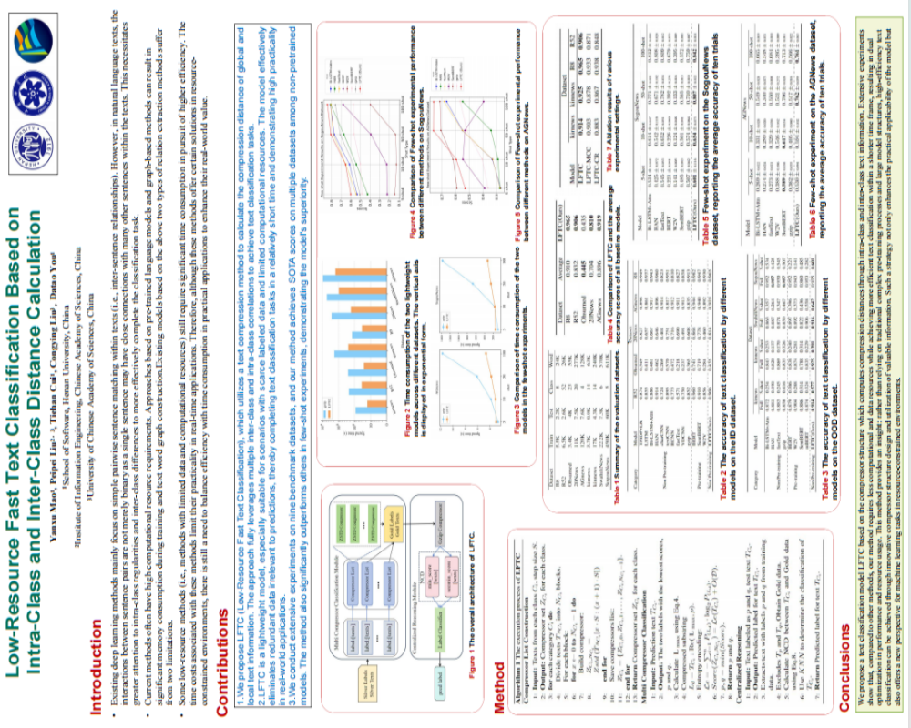

* Equal contribution. † Corresponding author.

<h3>🏅 <strong>Published</strong></h3>

<!-- 第一个论文条目 -->

  
  

    <strong>Yanxu Mao</strong>, Peipei Liu†, Tiehan Cui, Congying Liu, and Datao You.  
    Low-Resource Fast Text Classification Based on Intra-Class and Inter-Class Distance Calculation.  
    <strong>（2025） Proceedings of the 31st International Conference on Computational Linguistics.（CCF-B）</strong>
    <a href="https://aclanthology.org/2025.coling-main.70/" target="_blank">[Paper]</a>
  

<!-- 第二个论文条目 -->

  
  

    <strong>Yanxu Mao</strong>, Xiaohui Chen, Peipei Liu†, Tiehan Cui, Zuhui Yue, and Zheng Li.  
    GEGA: Graph Convolutional Networks and Evidence Retrieval Guided Attention for Enhanced Document-level Relation Extraction.  
    <strong>（2025） IEEE International Conference on Acoustics, Speech and Signal Processing. （CCF-B）</strong>
    <a href="https://ieeexplore.ieee.org/document/10889649" target="_blank">[Paper]</a>
  

<h3>⏳ <strong>Under Review</strong></h3>

  <!--  -->
  

    <strong>Yanxu Mao</strong>, Peipei Liu†, Tiehan Cui, Congying Liu, and Datao You.  
    Divide and Conquer: A Hybrid Strategy Defeats Multimodal Large Language Models.  
    <strong>（Under Review）</strong>
  

